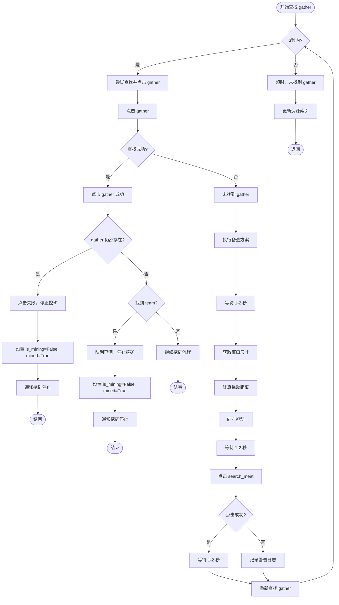

# Gather 查找流程图

# 流程说明

## 主要逻辑
1. **3秒超时机制**：在3秒内不断尝试查找并点击 gather
2. **查找成功**：点击 gather，然后检查 gather 是否仍然存在
3. **点击失败**：如果 gather 仍然存在，说明点击失败，停止挖矿
4. **查找失败**：执行备选方案（向左移动并重新点击 search_meat）
5. **备选方案**：
   - 等待 1-2 秒
   - 获取窗口尺寸，计算拖动距离
   - 向左拖动
   - 等待 1-2 秒
   - 点击 search_meat
   - 重新查找 gather
6. **超时处理**：3秒内未找到 gather，更新资源索引并返回

## 关键判断点
- **gather 仍然存在**：说明点击失败，停止挖矿
- **找到 team**：说明队列已满，停止挖矿
- **点击成功**：继续挖矿流程

## 次要逻辑
- 用户手动停止：随时检查 `_user_stopped` 标志
- 窗口尺寸自适应：根据窗口宽度计算拖动距离（基准30像素）
